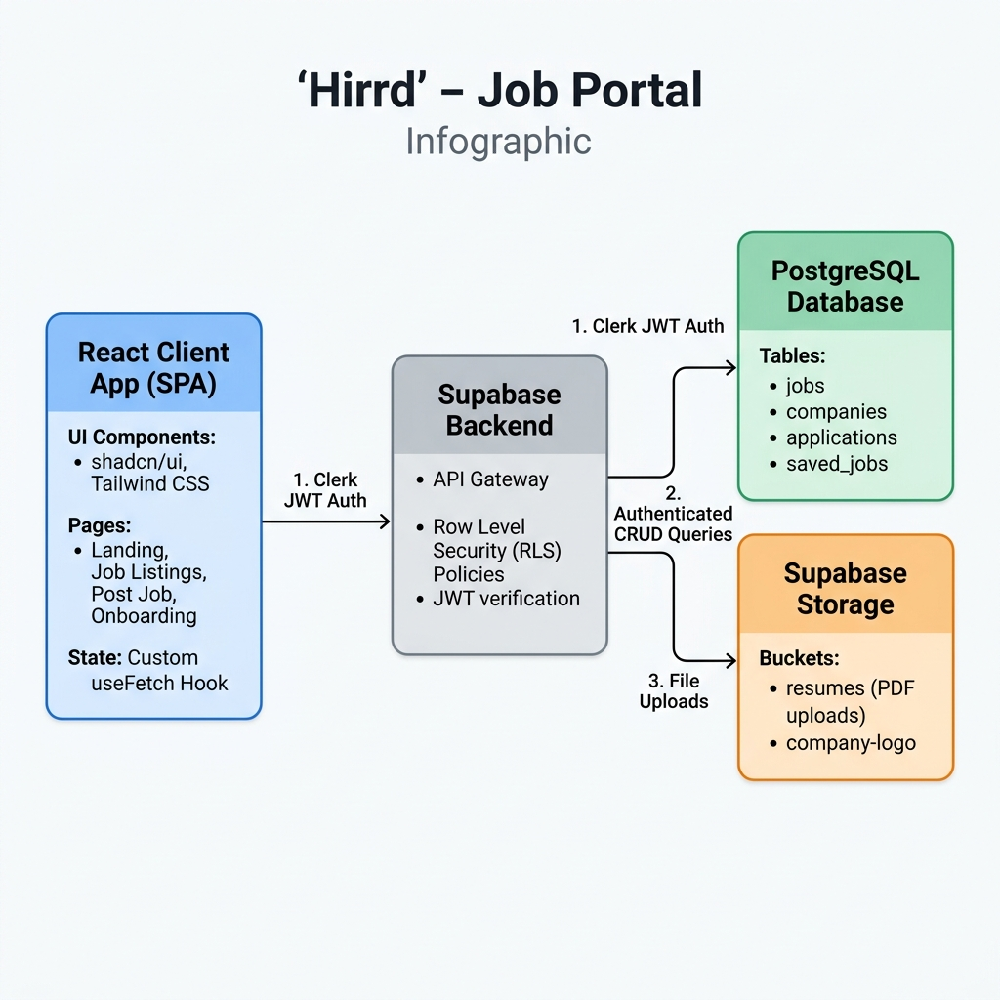

# Job Portal

A modern job portal built with React, Supabase, and Clerk, designed to connect recruiters with job seekers. This platform allows recruiters to post job openings while enabling job seekers to discover and apply for relevant positions.

## Features

- **User Authentication & Authorization**
  - Secure authentication using Clerk
  - Role-based access control (Recruiter/Job Seeker)
  - Email/Password and Social Logins

- **For Recruiters**
  - Create and manage job postings
  - View and manage applications
  - Company profile management

- **For Job Seekers**
  - Browse and search job listings
  - Apply to jobs with resume upload
  - Save favorite job postings
  - Track application status

- **Modern UI/UX**
  - Built with shadcn/ui components
  - Responsive design for all devices
  - Intuitive navigation and user flows

## Tech Stack

- **Frontend**: React 18, Vite, JavaScript
- **UI Components**: shadcn/ui, Tailwind CSS
- **Authentication**: Clerk
- **Backend & Database**: Supabase with PostgreSQL
- **State Management**: Custom Fetch Hook (`useFetch`) + React State
- **Form Handling**: React Hook Form with Zod validation
- **Deployment**: Vercel/Netlify ready

## System Architecture

The following diagram illustrates the system architecture and end-to-end data workflow of the Job Portal application, highlighting how the React client, Clerk authentication, and Supabase backend-as-a-service interact:



<details>
  <summary><b>View Interactive Mermaid Diagram Source</b></summary>

```mermaid
graph TD
    %% Styles
    classDef client fill:#f4f4f5,stroke:#3f3f46,stroke-width:2px,color:#18181b;
    classDef auth fill:#eff6ff,stroke:#2563eb,stroke-width:2px,color:#1e3a8a;
    classDef backend fill:#ecfdf5,stroke:#059669,stroke-width:2px,color:#064e3b;
    classDef storage fill:#fff7ed,stroke:#ea580c,stroke-width:2px,color:#7c2d12;

    %% Subgraphs
    subgraph Client [Client Application - React SPA]
        UI[shadcn/ui Components & Layouts]
        Pages[React Pages / Views]
        Hook[useFetch Custom Hook]
        SClient[Supabase Client Utility]
    end

    subgraph Auth [Authentication]
        Clerk[Clerk Auth SDK]
    end

    subgraph Supabase [Supabase Backend-as-a-Service]
        RLS[Row Level Security RLS Policies]
        
        subgraph Database [PostgreSQL Database]
            jobs[(jobs table)]
            companies[(companies table)]
            applications[(applications table)]
            saved_jobs[(saved_jobs table)]
        end

        subgraph Storage [Storage Buckets]
            resumes[(resumes bucket)]
            logos[(company-logo bucket)]
        end
    end

    %% Connections
    UI --> Pages
    Pages --> Hook
    Hook --> Clerk : 1. Request Supabase JWT
    Clerk -- Supabase JWT --> Hook
    Hook --> SClient : 2. Instantiate with JWT
    SClient --> RLS : 3. Authenticated Queries
    
    RLS --> jobs
    RLS --> companies
    RLS --> applications
    RLS --> saved_jobs
    
    RLS --> resumes
    RLS --> logos

    %% Class Assign
    class UI,Pages,Hook,SClient client;
    class Clerk auth;
    class RLS,jobs,companies,applications,saved_jobs backend;
    class resumes,logos storage;
```
</details>

### Architectural Flow:
1. **User Authentication**: Users sign in using **Clerk**. When a protected action is performed, the custom `useFetch` hook requests a Supabase-templated JWT from Clerk.
2. **Authorized Request**: The client-side `supabaseClient` is initialized dynamically with the user's JWT. All API requests are then sent to **Supabase** with this token.
3. **Data Security**: **Row Level Security (RLS)** policies on Supabase validate the user's identity and determine permission levels (e.g. allowing recruiters to edit hiring status or candidates to view their applications).
4. **Storage & Assets**: Application files (like candidate PDF resumes and company branding logos) are stored in dedicated **Supabase Storage Buckets**.

## Getting Started

### Prerequisites

- Node.js 16+ and npm/yarn/pnpm
- Supabase account
- Clerk account

### Installation

1. Clone the repository
   ```bash
   git clone https://github.com/yourusername/job-portal.git
   cd job-portal
   ```

2. Install dependencies
   ```bash
   npm install
   # or
   yarn
   # or
   pnpm install
   ```

3. Set up environment variables
   Create a `.env` file in the root directory and add:
   ```env
   VITE_SUPABASE_URL=your_supabase_url
   VITE_SUPABASE_ANON_KEY=your_supabase_anon_key
   VITE_CLERK_PUBLISHABLE_KEY=your_clerk_publishable_key
   ```

4. Start the development server
   ```bash
   npm run dev
   # or
   yarn dev
   # or
   pnpm dev
   ```

## Project Structure

```
job-portal/
├── public/          # Static files
├── src/
│   ├── components/  # Reusable UI components
│   ├── pages/       # Page components
│   ├── lib/         # Utility functions and configurations
│   ├── hooks/       # Custom React hooks
│   ├── types/       # TypeScript type definitions
│   ├── styles/      # Global styles
│   └── App.tsx      # Main application component
├── .env.example     # Example environment variables
└── ...
```

## Contributing

Contributions are welcome! Please follow these steps:

1. Fork the repository
2. Create a feature branch (`git checkout -b feature/AmazingFeature`)
3. Commit your changes (`git commit -m 'Add some AmazingFeature'`)
4. Push to the branch (`git push origin feature/AmazingFeature`)
5. Open a Pull Request

## License

This project is licensed under the MIT License - see the [LICENSE](LICENSE) file for details.

## Acknowledgments

- [Vite](https://vitejs.dev/) for the amazing build tooling
- [Supabase](https://supabase.com/) for the backend services
- [Clerk](https://clerk.com/) for authentication
- [shadcn/ui](https://ui.shadcn.com/) for the beautiful components
